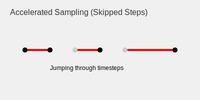

# Accelerated Trajectory Sampling (Skipped Steps)

Standard diffusion models require hundreds or thousands of steps to generate an image. DDIM allows for sampling from a subset of timesteps, drastically reducing the time required.

## Detailed Information
The DDIM formulation allows us to define a subsequence of timesteps $\{\tau_1, \dots, \tau_S\}$ where $S \ll T$. We only evaluate the model at these specific timesteps.

### Benefits
- **Speed:** Can generate high-quality images in as few as 10-50 steps, compared to the 1000 steps often required by DDPM.
- **Efficiency:** Reduces the computational cost of sampling, making it feasible for real-time applications.

## Diagram

[Back to README](../README.md)
