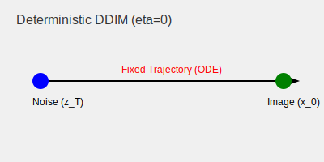

# Pure Deterministic DDIM ($\eta = 0$)

When $\eta = 0$, the backward diffusion process becomes entirely deterministic. This is the most common use case for DDIM, as it allows for a bijective mapping between the image space and the latent (noise) space.

## Detailed Information
The deterministic nature of DDIM is achieved by setting the stochasticity parameter $\eta$ to zero. This simplifies the sampling equation to a form that corresponds to an Ordinary Differential Equation (ODE) solver.

### Benefits
- **Latent Space Inversion:** You can take an image, find the noise that generates it, and then modify that noise to edit the image.
- **Interpolation:** Since the mapping is deterministic, you can linearly interpolate between two noise vectors to get a smooth transition between two generated images.
- **Consistency:** Useful for video generation where you want each frame to be consistent with the previous one.

## Diagram

[Back to README](../README.md)
