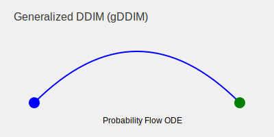

# Continuous-Time gDDIM (Generalized DDIM)

Generalized DDIM (gDDIM) extends the DDIM framework to treat the discrete steps as a continuous-time probability flow ODE.

## Detailed Information
gDDIM provides a more robust mathematical framework that allows for the application of advanced numerical ODE solvers. This further optimizes the sampling trajectories and improves the overall quality of the generated samples.

### Benefits
- **Mathematical Rigor:** Connects diffusion models with the field of differential equations.
- **Optimization:** Allows for the use of solvers like Runge-Kutta or Heun's method for even better efficiency.

## Diagram

[Back to README](../README.md)
