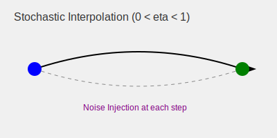

# Stochastic Interpolation ($0 < \eta < 1$)

This variant represents a hybrid spectrum between traditional DDPM and pure DDIM. It allows for a controlled amount of noise to be added during the reverse process.

## Detailed Information
By setting $0 < \eta < 1$, the generative process remains somewhat stochastic. This can help in generating more diverse samples or improving the quality of the generated images by introducing a bit of "creativity" or variation at each step.

### Benefits
- **Tunable Variation:** You can control how much randomness you want in your generation.
- **Quality Trade-off:** Sometimes a bit of noise helps in avoiding artifacts that might occur in a purely deterministic path.

## Diagram

[Back to README](../README.md)
